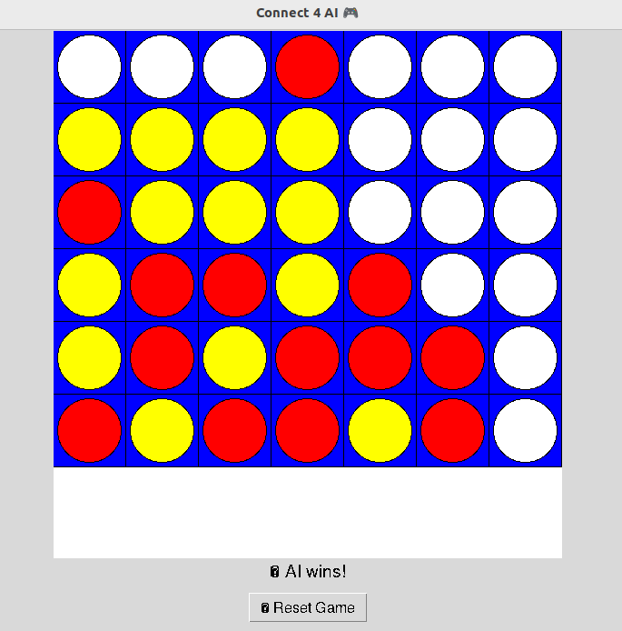

## Connect 4 AI (Minimax + Bayesian + Narration)

This project was built to reinforce foundational AI concepts by implementing an intelligent agent that plays Connect 4 against a human. The goal was to apply classic algorithms from an Intro to AI course and integrate them into a functional, user-facing application. For GUI, I went with the classic Tkinter interface.

### What It Does

- Implements a game-playing AI using the **Minimax algorithm with alpha-beta pruning**
- Adds **heuristic evaluation** to assess board states
- Models player behavior with **Bayesian reasoning** to predict future moves
- Uses a basic **natural language module** to explain AI decisions
- Includes both a **CLI version** and a **Tkinter GUI interface**

### Key Concepts Applied

- Problem representation as game trees
- Decision-making with Minimax + pruning
- Probabilistic modeling (Bayes theorem)
- Explainable AI (interpretable move explanations)
- Basic UI development with Tkinter

### Skills & Tools Used

- Python (data structures, OOP, Tkinter)
- Algorithms: Minimax, alpha-beta pruning, Bayes
- AI fundamentals (search, heuristics, decision-making)
- Modular code organization and logging

